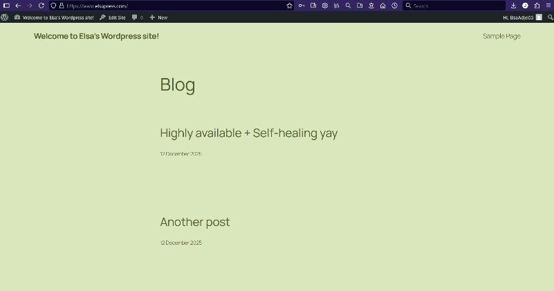
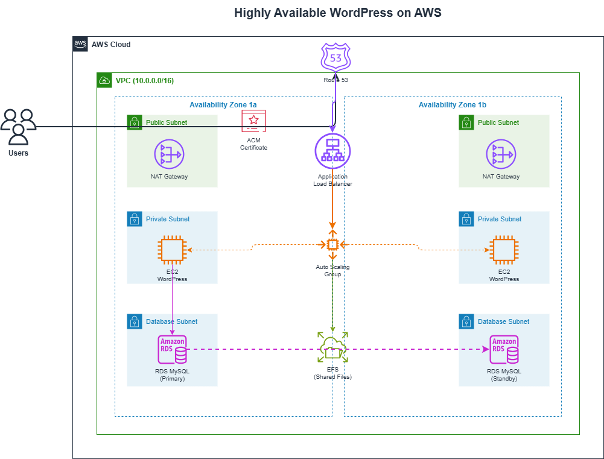

# Terraform AWS WordPress HA

> A highly available WordPress deployment on AWS, fully automated with Terraform.

## What This Does

This project deploys a WordPress website that automatically recovers from server failures, scales with traffic, and keeps data safe across multiple availability zones.

If a server dies at 3 AM, a new one spins up automatically. No manual intervention required.

## Why This Exists

I built this to learn AWS infrastructure and Terraform by solving a real problem: deploying a web application that doesn't go down when things break.

It also serves as a reusable template for WordPress deployments that need high availability without the complexity of Kubernetes.

## How It Works (High Level)

1. User visits the website, request hits Route 53 for DNS resolution
2. Application Load Balancer distributes traffic to healthy EC2 instances
3. WordPress serves content, with files stored on EFS and data in RDS
4. If an instance fails, Auto Scaling Group replaces it automatically

## Demo



## Key Features

- **High Availability:** Multi-AZ deployment survives instance and availability zone failures
- **Auto-Healing:** Unhealthy instances replaced automatically
- **SSL/HTTPS:** ACM certificates with HTTP to HTTPS redirect
- **Infrastructure as Code:** Entire stack reproducible and version-controlled
- **Security Hardened:** Private subnets, least-privilege security groups, Checkov audited

## Technology Choices

- **Terraform:** Repeatable infrastructure that can be reviewed, versioned, and destroyed cleanly
- **EFS:** Shared filesystem so all instances see the same WordPress files
- **RDS Multi-AZ:** Database failover handled automatically by AWS
- **Application Load Balancer:** SSL termination, health checks, and traffic distribution in one service
- **Cloud-init:** Instances configure themselves on boot, no manual setup required

## Architecture Overview



All compute resources sit in private subnets. Only the load balancer is publicly accessible.

## Getting Started

### Prerequisites

- Terraform >= 1.0
- AWS CLI configured with appropriate permissions
- A domain with a hosted zone in Route 53

### Installation

```bash
git clone https://github.com/ElsaDevOps/terraform-aws-wordpress-ha.git
cd terraform-aws-wordpress-ha

cp terraform.tfvars.example terraform.tfvars
# Edit terraform.tfvars with your domain and database credentials
```

### Deployment

```bash
terraform init
terraform plan
terraform apply
```

### Teardown

```bash
terraform destroy
```

## Project Status

**Current state:** Complete

**Working:**
- Multi-AZ deployment with automatic failover
- SSL/HTTPS with proper redirects
- Shared storage across instances
- Security audit passed (Checkov: 100 passed, 28 skipped for cost reasons)

**Planned improvements:**
- CloudFront CDN for static assets
- ElastiCache for session storage (removes sticky session dependency)
- AWS WAF integration
- Automated backups to S3

## Challenges and Learnings

**SSL redirect loops:** WordPress didn't recognize HTTPS requests because SSL terminates at the load balancer. Fixed by checking the `X-Forwarded-Proto` header in wp-config.php.

**Session persistence:** Users were losing sessions when requests hit different instances. Solved with sticky sessions on the target group and proper cookie domain configuration.

**Route 53 record conflicts:** Redeployments failed with "record already exists" errors. The `allow_overwrite` flag resolved this.

**Configuration drift:** Manual fixes on instances disappeared when instances were replaced. Learned to put all configuration in cloud-init so new instances are correctly configured automatically.

## Cost Estimate

| Resource | Configuration | Monthly Cost |
|----------|---------------|--------------|
| EC2 | 2x t3.small | ~$30 |
| RDS | db.t3.micro Multi-AZ | ~$25 |
| ALB | Basic usage | ~$20 |
| NAT Gateway | 2x | ~$65 |
| EFS | Minimal storage | ~$2 |
| **Total** | | **~$142** |

Single NAT Gateway reduces cost by ~$32 for non-production use.

## Contact

Open an issue or connect with me on [LinkedIn](www.linkedin.com/in/elsadevops).
